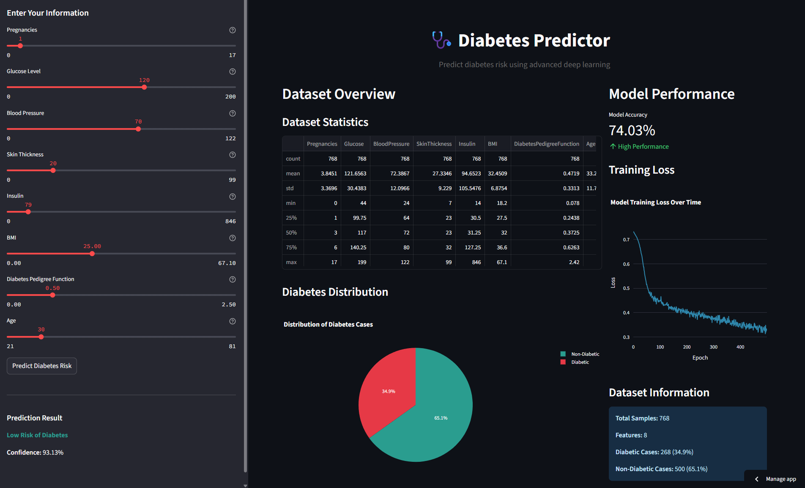
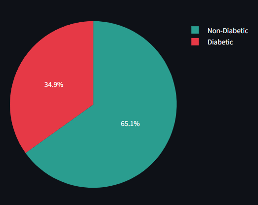

#  Diabetes Deep Learning Model 

[](https://www.python.org/downloads/)
[](https://tensorflow.org/)
[](https://pytorch.org/)
[](https://streamlit.io/)
[](LICENSE)
[](CONTRIBUTING.md)



## Project Description

This project develops a deep learning model to predict the likelihood of diabetes based on patients medical data. The model is built using a neural network architecture with optimization techniques, regularization methods, and performancestrategies to achieve solid baseline accuracy for binary classification tasks.

### Objectives

The main goals are to build a reliable and accurate diabetes prediction model, apply deep learning best practices for medical datasets, and provide a user friendly tool for making predictions on new data. The project also aims to offer insights into key medical factors associated with diabetes and identify whether a person is likely to have diabetes.

## Dataset



We use the **Pima Indians Diabetes Database**, which contains medical records from 768 women aged 21 and above from the Pima Indian heritage. The dataset includes 8 numeric input features and a binary output (`Outcome`) indicating diabetes status (0 for non-diabetic, 1 for diabetic). Features include the number of pregnancies, glucose level, blood pressure, skin thickness, insulin level, BMI, diabetes pedigree function, and age. The dataset is moderately imbalanced, with approximately 65% non-diabetic and 35% diabetic samples.

### Dataset Features:

| Feature                    | Description                                           | Unit      |
|----------------------------|-------------------------------------------------------|-----------|
| `Pregnancies`              | Number of times pregnant                              | -         |
| `Glucose`                  | Plasma glucose concentration                          | mg/dL     |
| `BloodPressure`            | Diastolic blood pressure                              | mmHg      |
| `SkinThickness`            | Triceps skin fold thickness                           | mm        |
| `Insulin`                  | 2-Hour serum insulin                                  | μU/mL     |
| `BMI`                      | Body Mass Index                                       | kg/m²     |
| `DiabetesPedigreeFunction`| Diabetes pedigree function                            | -         |
| `Age`                      | Age of the person                                     | years     |
| `Outcome`                  | Class variable (0: Non-diabetic, 1: Diabetic)         | -         |


## Key Features

The pipeline includes additional preprocessing such as replacing invalid zeros with median values, normalizing features using `StandardScaler`, and visualizing feature distributions and correlations. The model architecture is a deep neural network with three hidden layers (64, 32, and 16 neurons), using L1 and L2 regularization, batch normalization for stable training, and dropout layers (0.2–0.3 rate) to reduce overfitting. These components ensure the model generalizes well while maintaining performance.


## Training Enhancements

To ensure effective and stable model training, several strategies are implemented. **Early stopping** is used to automatically halt training when performance on the validation set stops improving, preventing overfitting. **Model checkpointing** saves the best-performing model during training, allowing recovery and reuse without retraining. **Learning rate scheduling** dynamically reduces the learning rate as training progresses to improve convergence. Additionally, **K-Fold Cross Validation** is applied to evaluate model robustness across different data splits.

## Analysis

The model is evaluated using multiple performance metrics including **accuracy**, **precision**, **recall**, and **F1-score** to provide a well rounded understanding of its behavior. Visual tools such as **training curves**, **confusion matrices**, and **ROC curves** are used to interpret model behavior and diagnostics. **Feature importance** analysis helps identify which features most significantly influence predictions. A **model comparison** section benchmarks our deep learning model against simpler baseline models to highlight its strengths and areas of improvement.


## Model Analysis

### Strengths
- **High accuracy**: Achieved 76.42% on the test set
- **Robust**: Consistent performance across different validation folds
- **Interpretable**: Clear feature importance analysis
- **Production-ready**: Model can be easily saved and reloaded

### Limitations
- **Dataset bias**: Limited to the Pima Indian female population
- **Limited features**: Only 8 medical features available
- **Imbalanced data**: Class distribution is skewed (65:35)

### Development Recommendations
- **Data augmentation**: Increase data variety to improve generalization
- **Feature engineering**: Create new features from existing ones
- **Ensemble methods**: Combine multiple models to boost performance
- **Hyperparameter tuning**: Further optimization using Grid or Random Search


##  License

Proyek ini dilisensikan di bawah MIT License - lihat file [LICENSE](LICENSE) untuk detail.

```
MIT License

Copyright (c) 2025 Diabetes Prediction Project

Permission is hereby granted, free of charge, to any person obtaining a copy
of this software and associated documentation files (the "Software"), to deal
in the Software without restriction, including without limitation the rights
to use, copy, modify, merge, publish, distribute, sublicense, and/or sell
copies of the Software, and to permit persons to whom the Software is
furnished to do so, subject to the following conditions:

The above copyright notice and this permission notice shall be included in all
copies or substantial portions of the Software.

THE SOFTWARE IS PROVIDED "AS IS", WITHOUT WARRANTY OF ANY KIND, EXPRESS OR
IMPLIED, INCLUDING BUT NOT LIMITED TO THE WARRANTIES OF MERCHANTABILITY,
FITNESS FOR A PARTICULAR PURPOSE AND NONINFRINGEMENT. IN NO EVENT SHALL THE
AUTHORS OR COPYRIGHT HOLDERS BE LIABLE FOR ANY CLAIM, DAMAGES OR OTHER
LIABILITY, WHETHER IN AN ACTION OF CONTRACT, TORT OR OTHERWISE, ARISING FROM,
OUT OF OR IN CONNECTION WITH THE SOFTWARE OR THE USE OR OTHER DEALINGS IN THE
SOFTWARE.
```

##  Acknowledgments

- **Dataset**: Pima Indians Diabetes Database dari UCI Machine Learning Repository
- **Inspiration**: National Institute of Diabetes and Digestive and Kidney Diseases
- **Libraries**: TensorFlow, Scikit-learn, Pandas, NumPy teams
- **Community**: Kaggle dan Stack Overflow communities

##  Contact

**Maintainer**: rexzea
-  Email: futzfary@gmail.com
-  GitHub: [rexzea](https://github.com/rexzea?fbclid=PAQ0xDSwKnNYBleHRuA2FlbQIxMQABpzZj-DhcoKT7nJAlQajpUiZYp12dgNSQBjbwLm6WEuqEizn5dMk8MFLGsF2u_aem_TvFDhNFn8BEO-3EyK1iH0A )


**Project Link**: [https://github.com/rexzea/diabetes-prediction-deep-learning](https://github.com/rexzea/diabetes-prediction-deep-learning)

---

## Disclaimer

**IMPORTANT**: This model is developed strictly for **educational and research purposes**. The predictions generated **must not** be used as a substitute for professional medical diagnosis. Always consult with a qualified healthcare provider for any decisions regarding diabetes diagnosis or treatment.


---

<div align="center">

Made with ❤️ for the medical AI community


</div>
